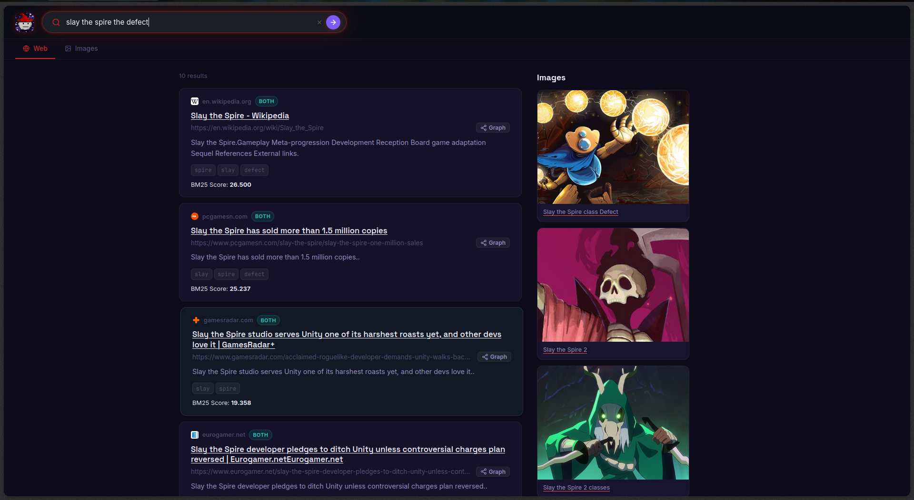
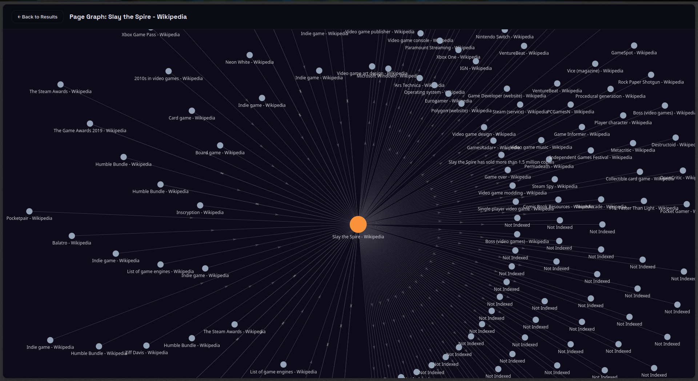
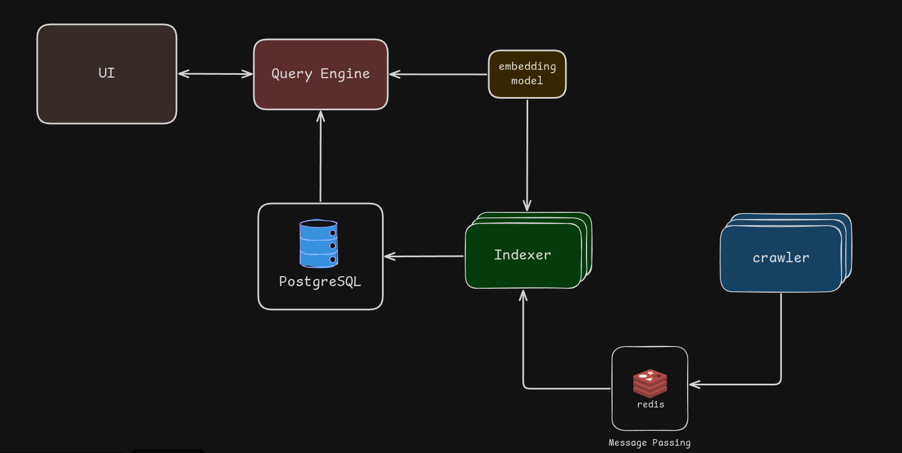
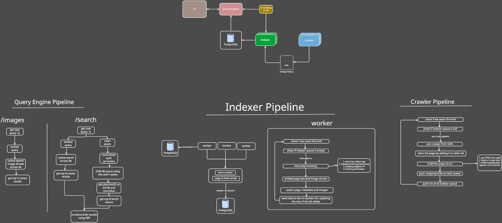

# gazoogle

gazoogle is a search engine, made from scratch by me to learn how search engines work under the hood — indexing, ranking, and retrieval at a systems level, not just calling an API.

It's basically Google 30 years ago or so (probably worse).

> just gazoogle it!

I crawled and indexed 60k+ pages during testing.  


#### Search Results


#### Link Graph


## Tech Stack

- **Go** — crawler & indexer
- **TypeScript / Express** — query engine
- **PostgreSQL + pgvector** — inverted index & embeddings
- **Redis** — crawl frontier / message passing
- **React** — UI
- **Docker Compose** — orchestration

## Features

- **Searching Pages**: search web pages by terms, with results ranked by combining BM25 and semantic vector search.
- **Searching Images**: search images by their `alt` text with semantic vector search.
- **Link Graph**: view a link graph per page showing its forward and back links.

## Architecture

gazoogle is a distributed system, each component runs as its own independent service.

### Diagram

This is the high level overview of the app's architecture.



### Services

- **Crawler**: Scrapes web pages recursively, discovering new links and storing processed pages in Redis.

- **Indexer**: Takes the crawled pages from Redis, runs text transformation, and stores the result in Postgres in an inverted index structure.

- **Query Engine**: Takes user queries, does spell correction, searches the database, calculates BM25 on the fly, runs cosine vector search, then ranks and merges both result sets using RRF.

- **UI**: A simple, user-friendly web application that uses the query engine as its backend API to expose the app's features.

### Other Components

- `redis`: Used mainly as message passing between the crawler and the indexer.

- `postgres`: The main DB, storing all indexed page info — BM25-relevant data (tf, df) and embeddings. Also used by the query engine to gather results.

- `embedding service`: An API service hosting a small embedding model (`all-MiniLM-L6-v2`), used by the indexer to embed page content/image alt text and by the query engine to embed user queries.

### Full Excalidraw image



> go nuts


## Setup

0. Make sure you have `docker` and `docker compose` installed on your machine.
1. Clone the repo:

```sh
git clone https://github.com/1Gazzar1/gazoogle
cd ./gazoogle
```

2. Configure your environment variables in the `x-common-env` section inside `docker-compose.yaml` (the defaults will also work).
3. Start the app:

```sh
docker compose up
```

4. Open `http://localhost:80` in your browser and start searching.

## Notes

There are separate per-service READMEs in each service folder:

- [crawler](./crawler/README.md)
- [indexer](./indexer/README.md)
- [query_engine](./query_engine/README.md)
