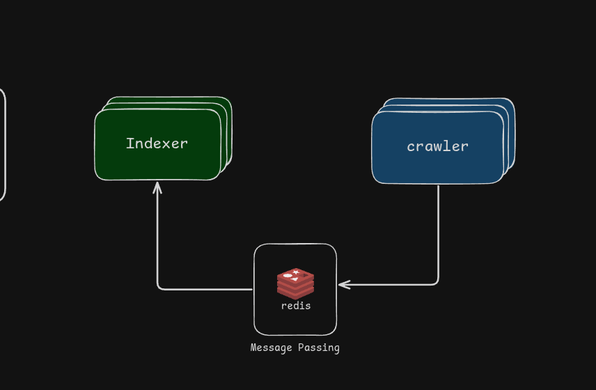
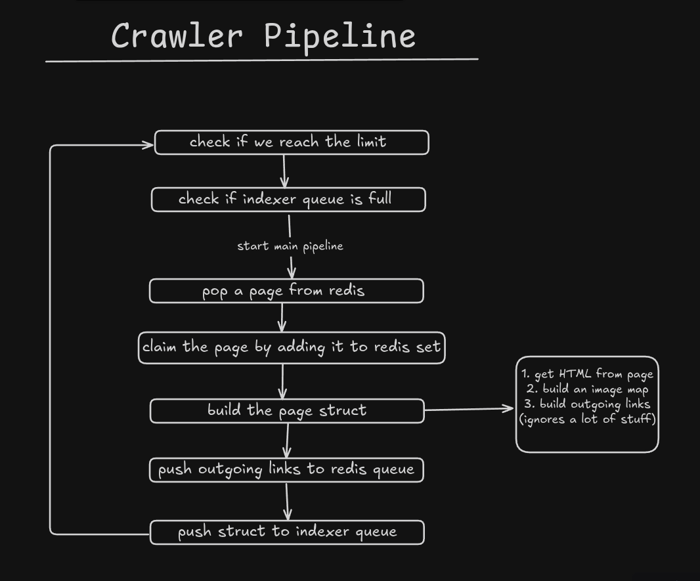

# Crawler

## Overview

This service's job is to crawl pages starting from a seed URL, extract their content and links, and pass that data to the indexer for processing.

## Dependancies

- redis
- go

### redis

Redis is used for:

1. `priority.queue` — holds all pages we want to scrape next
2. `pages` set — tracks all pages we've already scraped, so we don't repeat work
3. `indexer.queue` — holds the HTML of scraped pages, waiting for the indexer to pick them up

### go

Go is used for its concurrency model. Workers run in parallel using the worker pattern, each pulling and pushing to redis independently. This is safe because redis executes commands atomically (single-threaded), so there's no risk of two workers claiming the same page.

## Architecture

## Pipeline

### Starting page

The crawler has to start somewhere, so it scrapes URLs from a seed page and recursively does the same for every URL it discovers.

For this project, the seed is the Ultrakill wiki :> (see [constants](./constants/constants.go))

> We push the seed URL to `priority.queue` at startup.
> Workers start by popping a URL from `priority.queue`.

### Scraping

1. We disguise as a browser using a `User-Agent` header.
2. We enforce a 15 second timeout so slow or broken pages don't stall workers.
3. We fetch the full HTML of the page.
4. We build a struct containing the page's data: URL, outgoing links, image links, title, and raw HTML.

> While extracting outgoing links, we filter out certain domains and link types we don't want to crawl.
> See [extract_HTML.go](./util/extract_HTML.go)

### Redis writes

- Before building the page struct, we claim the page by adding it to the `pages` set.
- After building the struct, we loop over its outgoing links and push each one to `priority.queue`.
- We then marshal the struct to JSON and push it to `indexer.queue`.

> See [constants](./constants/constants.go) for the actual redis key names.

### Other details

On top of the core loop, the crawler also:

- Stops once it hits the configured page limit.
- Pauses a worker for a second if `indexer.queue` grows past a certain size, so the indexer doesn't fall too far behind.
- Ignores domains that return with 429 (too many requests) for a certain amount of time to avoid being rate limited, then pauses the goroutine for 1 second.

## Recap

