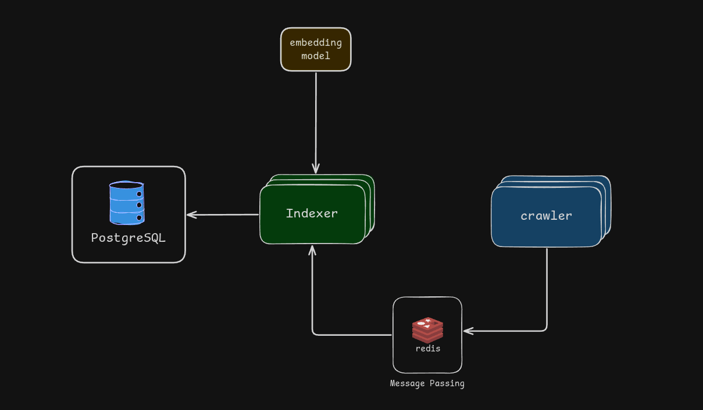
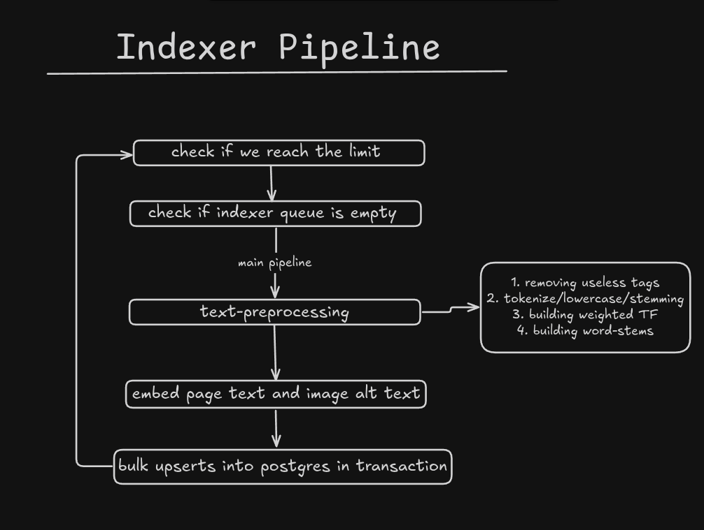

# Indexer

## Overview

This service receives HTML pages from the crawler, processes them, and stores the results in Postgres in a structured, queryable form.

## Dependancies

- go
- redis
- postgres
- embedding service

### go

Used again for concurrency and raw speed when processing pages.

### redis

Acts as the message queue between the crawler and indexer. The indexer pops pages off `indexer.queue`, which the crawler pushes to.

### postgres

Stores all the structured data extracted from each page, which is later used to calculate BM25 scores.

### embedding service

An internal API that generates embeddings. The indexer uses it to embed page content and image alt text.

## Schema

Probably the most important part of the whole system.
It's gone through several iterations to get here.

[schema diagram](path/to/photo)

> See [schema.sql](./db/schema.sql) for the full schema with comments.

## Architecture

## Pipeline

### Redis

- Pop a page off `indexer.queue` and unmarshal it back into a struct.

### Pre-processing

- Strip out non-content tags like `script`, `style`, `svg`, etc.
- For meaningful tags (`p`, `h1`, and similar), run the standard text pipeline: tokenize, lowercase, strip punctuation, stem (`running` → `run`, `study` → `studi`).
- From that, build:
    - Original text (kept for embedding).
    - A word-stem map to track vocabulary, e.g. `{"study": "studi", "running": "run"}`.
    - A term frequency map for BM25, e.g. `{"game": 7.5, "play": 4}`.

> The term frequency map isn't raw TF — it's weighted. A word in `<title>` counts 5x more than the same word in a `
`.
> See [constants](./constants/constants.go) for the per-tag weights.

### Embeddings

Page content and image alt text are embedded via the embedding service before being written to postgres.

### Postgres

Once we have the page data and embeddings, we write everything with bulk upserts:

- Upsert the page row.
- Bulk upsert the page's terms to track document frequency (`df`) — terms are sorted first to avoid deadlocks from inconsistent lock ordering.
- Bulk insert the term frequency map into the postings table.
- Bulk upsert the word-stem map into the vocab table.
- Insert blank placeholder pages so link inserts don't fail on missing targets.
- Bulk insert into the links table, updating outgoing/back links.
- Update the metadata table (total document count, average doc length).
- Bulk insert images.

> All of this runs inside a single transaction — if any step fails, everything rolls back.

### Other details

Before running the main pipeline, the indexer also:

- Checks if `indexer.queue` is empty and, if so, waits 5 seconds for the crawler to catch up.
- Checks if the page limit has been reached and stops if so.

## Recap

## Limitations

- **Stop words aren't stored in the postings table.** Words like "the," "who," or "how" are stripped entirely during cleaning, so queries relying on them lose that signal. In practice, plenty of real queries include stop words. Fixing this properly would mean a smarter cleaning step instead of blindly removing stop words.

- **Tokens like `v1.4.5` break.** The cleaning step replaces any non-alphanumeric character with a space, so `v1.4.5` becomes `v1 4 5`. After tokenizing and dropping single-character tokens, only `v1` survives. A better cleaning algorithm would need to handle punctuation and version-like patterns as first-class cases instead of stripping them blindly.
