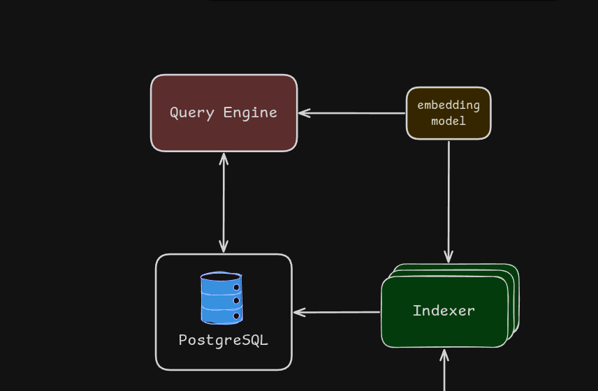
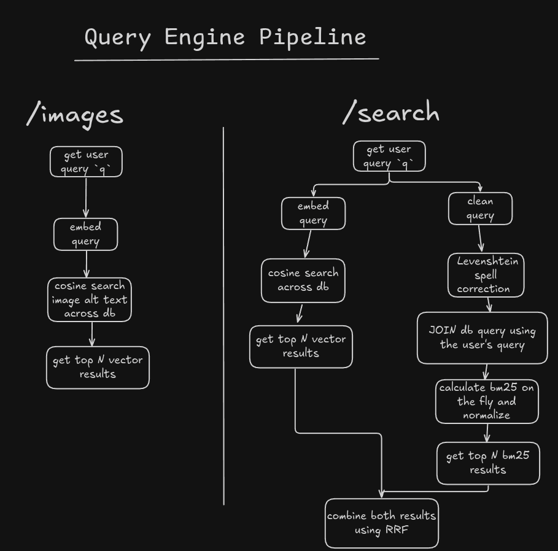

# Query Engine

## Overview

This service processes a user's search query, compares it against the database, and returns the closest matching pages.

## Dependencies

- typescript
- embedding service
- postgres

### typescript

Chosen for type safety across the query pipeline, plus familiarity with Express for building the API layer.

### embedding service

Embeds the user's query so it can be compared against page embeddings in the database.

### postgres

Fetches query-relevant data and is used to calculate BM25 scores.

## Architecture

## Pipeline

The query engine exposes 3 endpoints (more may be added):

- `/search` — takes a query string `q`
- `/images` — takes a query string `q`
- `/links/:id` — takes `id` as path parameter

### `/search`

- Take the user query (`q`) and embed it upfront, for later use.
- Run the same pre-processing used in the indexer: tokenize and lowercase (no stemming yet).
- Spell-correct any word not found in the vocab, using closest Levenshtein match.
- Stem the corrected query and search postgres using the stems.
- Gather all BM25-relevant data in a single JOIN query.
- Calculate BM25 per posting, then normalize so pages with multiple matching terms collapse into one combined score.
- Run a cosine similarity search using the query embedding.
- Combine the BM25 and embedding results using RRF (Reciprocal Rank Fusion).

### `/images`

- Embed the user query.
- Run a cosine similarity search against image alt text embeddings.
- Return the results.

### `/links/:id`

- Returns the Backlinks and Forwardlinks for a Page using its id

> The purpose of this endpoint is to show a nice link graph page in the UI.

## Recap

